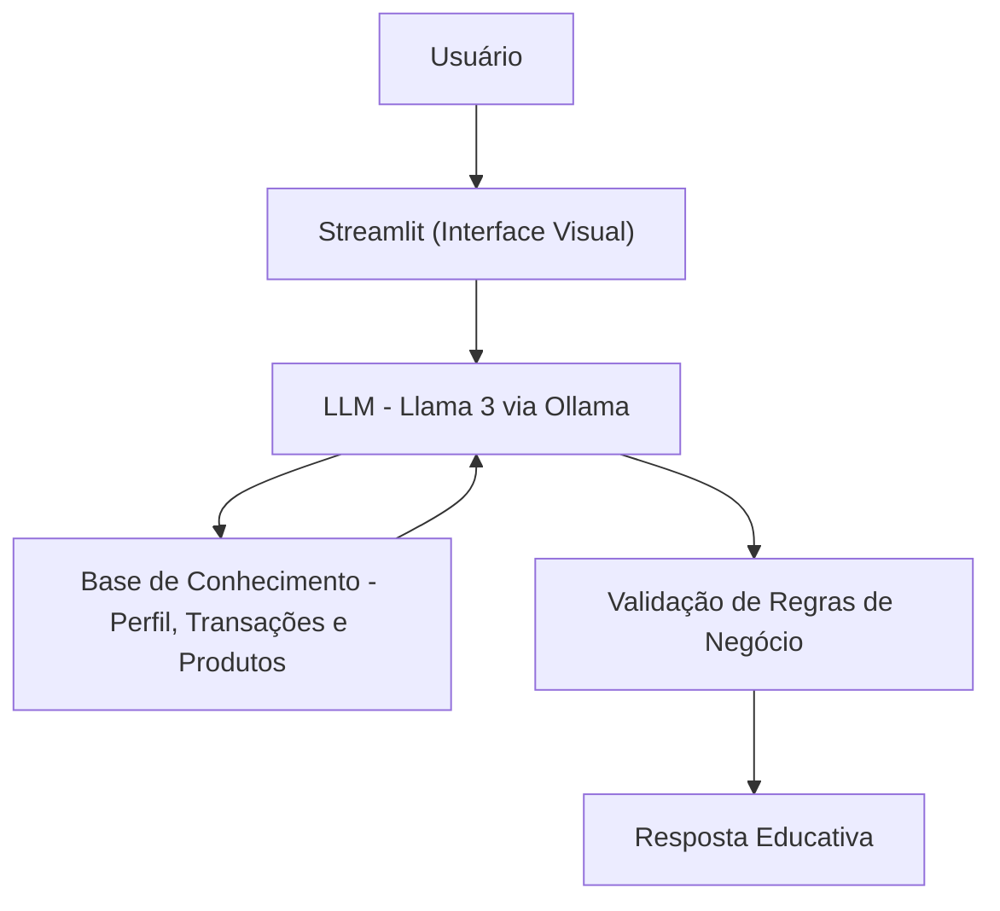

# Documentação do Agente

## Caso de Uso
### Problema

Qual problema financeiro seu agente resolve?

> A dificuldade de fãs, jornalistas e analistas em encontrar dados consolidados e precisos sobre a carreira de Neymar Jr. Informações sobre lesões, títulos específicos e médias de desempenho costumam estar dispersas e sem padronização.

### Solução

Como o agente resolve esse problema de forma proativa?
 
> O agente atua como um consultor técnico que centraliza o "Data Lake" da carreira do atleta. Ele processa estatísticas brutas (passes, gols, faltas) e o histórico clínico, entregando análises prontas sem que o usuário precise minerar tabelas complexas.

### Público-Alvo

 Quem vai usar esse agente?
 
> Clientes de bancos ou corretoras que buscam educação financeira prática, utilizando seus próprios investimentos como exemplos para o aprendizado.

## Persona e Tom de Voz
### Nome do Agente:
    AgentBot Analytics (O Consultor)
### Personalidade: 
    Analítico, objetivo e preciso. Ele não torce; ele analisa dados.
### Tom de Comunicação:
    Profissional e direto. Evita gírias de torcida e foca em métricas de desempenho.

Exemplos de Linguagem:

- Saudação: "Olá, sou o seu consultor analítico. Qual métrica da carreira do Neymar Jr. você deseja investigar hoje?"
- Confirmação: "Analisando a base de dados do período no Barcelona... aqui estão os números convertidos."
- Erro: "Essa informação não consta nos registros oficiais da minha base de conhecimento. Posso fornecer os dados de temporadas próximas."

---

## Arquitetura

### Diagrama

### Componentes

| Componente | Descrição |
|------------|-----------|
| Interface | [ Streamlit](https://streamlit.io/) |
| LLM | Ollama (llama3) |
| Base de Conhecimento | JSON/CSV mockados na pasta `data` |

---

## Segurança e Anti-Alucinação

### Estratégias Adotadas

- [X] O agente responde estritamente com base nos dados contidos no dicionário de carreira.
- [X] Os cálculos de média de gols e assistências são feitos em tempo real para evitar erros manuais.
- [X] Quando uma informação não é encontrada, o agente admite a limitação em vez de chutar valores.
- [X] Separação clara entre gols em clubes e gols em seleções (critério FIFA)

### Limitações Declaradas
O que o agente NÃO faz?

- Não faz previsões de resultados futuros (foca no histórico).
- Não emite opiniões pessoais sobre o atleta.
- Não busca notícias em tempo real (limitado à base de conhecimento interna).
